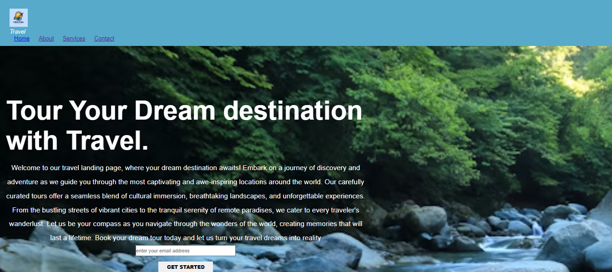

# landing Page🚀

## Project Description 📝

> this project is about making landing page. it has showed HTML coding language, is uesful for web development students, included some specific information about HTML.


- working with HTML flie inspired me to create this page.
- this will solve both theoreical and practical problems in the level of intermediate.
- during workung on this page, i learned more ideas about how creat Landing Page through HTML and CSS languages ,which codes i can use, how organize information together.
- using of HTML and CSS languages make this Landing Page stand out.

```html
    <header id="header">
      <div class="logo">
        
        <div class="btn">
          <i class="fa fa-bars menu-btn">Travel</i>
        </div>
      <nav id="nav-bar">
        <ul>
          <li><a class="nav-link" href="#features">Home</a></li>
          <li><a class="nav-link" href="#how you can have safe travel">About</a></li>
          <li><a class="nav-link" href="#which facilities provide to you">Services</a></li>
          <li><a class="nav-link" href="#prices">Contact</a></li>
        </ul>
      </nav>
      </div>
    </header>
```css
*{
  padding: 0;
  margin: 0;
  box-sizing: border-box;
  font-family: "poppins";
}

body {
  background-image: url(./assets/river.jpg);
  background-repeat: no-repeat;
  background-size: cover;
  padding-top: 150px;
}


## Technologies Used 🛠️

- HTML
- CSS

## Installation 💻

you must have account in GITHUB, have installed GIT bash, have installed visual studio code, an uppdate version of chrome.

```bash
# git cline git@github.com:sodabarauf/technical-documentation-page.git
```

```bash
# cd technical-documentation-page
```

```bash
# code .
```

## Usage 🎯

first clone the repository with your local machin, then open in vscode by (code .) command, after that commit regularly from every changes that you make.

```bash
# git clone
```

```bash
# code .
```
## Features ⭐

- making idea about creating landing page
- findig important issues about HTML CSS.

##demo 



## Author 👩‍💻

Sodaba Rauf

- GITHUB:[sodabarauf](https://github.com/sodabarauf)
- LinkedIn: [Sodaba Rauf](https://linkedin.com/in/sodaba-rauf)
- Email: [example](sodabarauf4@gmail.com)


## License 📜

Kick-StartDev/web-development-2024-student


